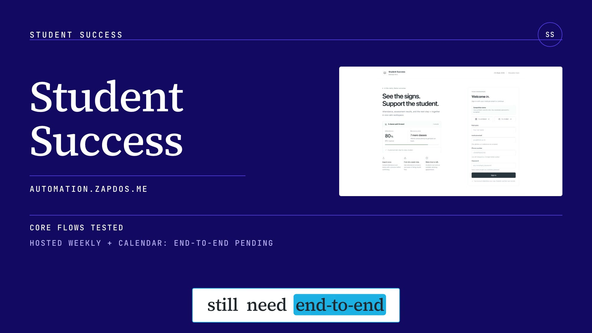
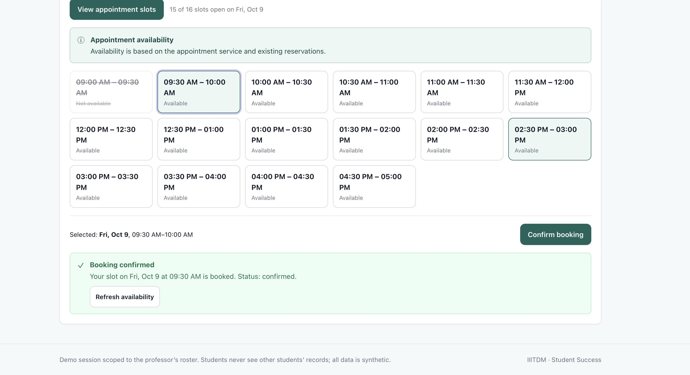
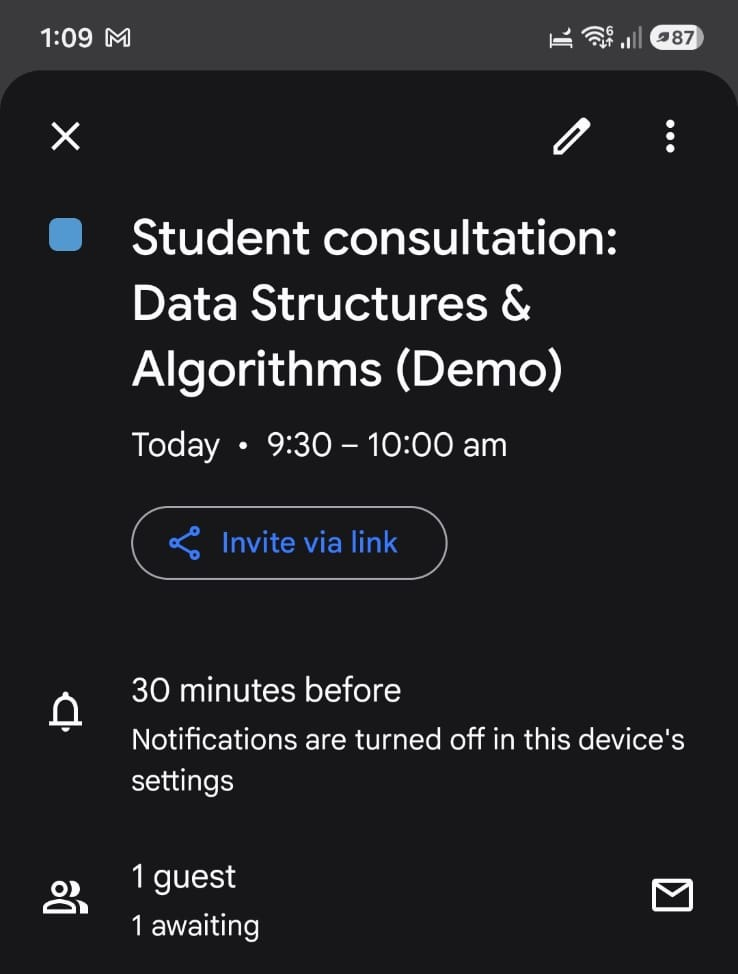

# Student Success — Babbage Bros

> **From class records to the next right intervention.**
>
> Upload attendance and test results. Student Success finds every student at risk, explains exactly why, warns the student, alerts the faculty, books the follow-up, and keeps a visible record of every automated action.

**CS Week 2026 · Education Track · a hosted, working solution**

| | |
|---|---|
| **Live application** | [https://automation.zapdos.me](https://automation.zapdos.me) |
| **Watch on Google Drive** | [Play the demo video](https://drive.google.com/file/d/19jopIIb_om1eBuyqnCYHLwsilI91GU4B/view?usp=sharing) |
| **Direct MP4** | [Download the video from GitHub](https://raw.githubusercontent.com/YashvanthSankar/babbageBrosAutomation/main/media/student-success-demo.mp4) |
| **Source** | [github.com/YashvanthSankar/babbageBrosAutomation](https://github.com/YashvanthSankar/babbageBrosAutomation) |

[](https://github.com/YashvanthSankar/babbageBrosAutomation/blob/main/media/student-success-demo.mp4)

**[▶ Play on Google Drive](https://drive.google.com/file/d/19jopIIb_om1eBuyqnCYHLwsilI91GU4B/view?usp=sharing)** · **[↓ Direct MP4 download](https://raw.githubusercontent.com/YashvanthSankar/babbageBrosAutomation/main/media/student-success-demo.mp4)** — a 1080p, ~90-second narrated tour of the live landing page and the real faculty dashboard.

---

## The problem, solved end to end

Faculty upload the attendance sheet and the recent test results. From that point the system runs the whole loop on its own:

**Upload → validate → commit → calculate risk → warn the student → alert the faculty → call when a student drops below 85% → offer a booking in the professor's free slots → show department- and subject-wise risk, most at-risk first → send a weekly summary.**

Every problem-statement requirement maps to a shipped, hosted capability:

| Problem-statement requirement | What Student Success does |
|---|---|
| **Upload attendance + recent test results** | Faculty import a roster first, then attendance and marks, as **CSV or Excel**. Every invalid row is reported before anything is written. |
| **Find students close to or below the required percentage** | Each subject carries a configurable attendance threshold (**85% by default**). The dashboard ranks students by risk. |
| **Calculate how many classes in a row to recover** | Deterministic recovery arithmetic — see [Explainable risk](#explainable-risk-not-a-black-box). No guessing, no model in the loop. |
| **Flag weak or falling marks** | Scores are normalized to percentages; below-threshold results and ≥10-point drops are flagged as weak or falling. |
| **Personal warning email to each student** | Risk transitions create **Resend** email activity, deduplicated so a re-upload never double-sends. |
| **Alert the subject teacher and faculty adviser** | Deduplicated adviser escalation plus a weekly cohort digest. |
| **Sync the teacher's timetable; book a free slot** | **Google Calendar** FreeBusy drives availability; a booking creates a real calendar event. A collision-checked local reservation prevents double-booking even before Google. |
| **Department-wise + subject-wise risk, most at-risk first** | Faculty overview: risk distribution, risk-by-subject, a department strip, and a ranked, paginated student directory. |
| **Weekly summary, sent automatically** | An ISO-week-deduplicated cohort summary endpoint, runnable on demand and schedulable with VPS cron. |
| **Automatic call when a student falls below 85%** | **OmniDimension** places a call on a *newly* below-threshold attendance transition — never on a page refresh or a re-upload. |

---

## Features

### For faculty

- **Define subjects and thresholds.** Attendance and marks thresholds per subject.
- **Import the roster first, then records.** Dashboard imports validate and return row-level errors; staged preview/confirm endpoints and downloadable Excel templates are also exposed.
- **CSV everywhere, Excel for every record type.** Excel marks take a test name, date, and maximum score; re-imports **correct** existing attendance and marks instead of double-counting them.
- **See who needs help, and why.** Students ordered by risk, with attendance, recovery classes, latest marks, and score movement side by side.
- **Review automated activity.** A live feed of email and call events with provider and status, deduplicated so the same intervention is never repeated.
- **Manual email and call tests.** Enter a recipient and trigger a real send or call on demand to demonstrate the integration live.
- **Weekly summary and adviser escalation.** Run the cohort digest on demand; replaying it reports `already_run` instead of duplicating.
- **Optional Google Calendar connection.** One consent maps an approved account to the professor; students then see real free/busy slots.

### For students

- **Their own records only.** Sign in with an institute email and see *their* subject attendance and marks — scoped from the session, never from the request body.
- **A clear path back.** The attendance gap and the exact number of consecutive classes needed to recover.
- **Weak and falling marks, surfaced.** Recent assessment results and the trend between them.
- **A way forward.** Book a professor appointment from the available slots.

---

## How the workflow runs

1. **Roster first.** Import each student's name, roll number, phone, and email. Later imports match by roll number; unknown students are reported, never silently attached to the wrong person.
2. **Validate before applying.** Invalid batches apply nothing. Confirmed batches are atomic and single-use.
3. **Calculate risk from the records.** Attendance and marks are normalized per student and subject; the dashboard puts the most urgent cases first and shows the facts behind each flag.
4. **Act after a successful import.** Imports create visible notification activity. Risk email is deduplicated by a snapshot of the current risk; a voice call is created only when attendance newly crosses below the threshold.
5. **Offer a way forward.** Students reserve a professor appointment; Convex rejects overlapping reservations, and a connected Google account turns the booking into a real calendar event.

Provider calls happen on the server **after** the data is safely committed. A failed send is recorded as an integration failure — it never undoes the professor's valid import. Opening or refreshing a dashboard never triggers a call or an email. An event marked `simulated` was not sent; `dispatched` means the provider accepted the request.

---

## Explainable risk, not a black box

High-stakes attendance arithmetic should be auditable, so the percentage and the recovery plan are computed directly from the imported records — never generated by a model.

For attendance threshold `t`, attended classes `p`, and recorded classes `n`:

```text
attendance percentage = 100 × p / n
recovery classes      = max(0, ceil((t × n − p) / (1 − t)))
```

`t` is the threshold as a fraction (`0.85` for 85%). The recovery count is the smallest number of consecutive attended classes that reaches the threshold.

**Example:** 16 attended out of 20 is 80%. At an 85% threshold the student needs **7 consecutive attended classes**: `(16 + 7) / (20 + 7) = 85.2%`.

Marks are compared as percentages, so results with different maximum scores are comparable. A result below the configured marks threshold is **weak**; a drop of at least 10 percentage points from the previous result is **falling**. The dashboard shows the inputs so faculty can judge the context.

---

## Architecture: one source of truth, explicit side effects

```text
Faculty CSV/XLSX ──> Next.js import adapter ──> validated preview / one-shot upload
                          │                              │
                          │                         Convex transaction
                          │                   roster · subjects · class dates · scores
                          │                              │
Student / faculty UI <── session-scoped API <── risk projections + cohort counts
                                                        │
                                after successful import ─┴─> durable action claim
                                                        │
                                          Resend email · OmniDimension voice
                                                        │
Student booking ──> Next.js session + subject checks ──> Convex overlap reservation
                     └─ Google OAuth: Calendar FreeBusy + event creation

VPS cron (weekly) ──> secret-gated endpoint ──> aggregate cohort summary
```

- **Next.js 14 + React 18 + TypeScript** serve the faculty and student interfaces and the session-scoped API.
- **Convex** is the canonical store: indexed roster/subject/record tables, atomic import confirmations, at-most-once action claims, and collision-checked booking.
- **Resend**, **OmniDimension**, and **Google Calendar** are the external edges, called server-side on the VPS.
- **Auth** is NextAuth; the professor is the exact configured `PROFESSOR_EMAIL`, and student records are resolved from the signed-in session.

**Trust boundaries.** The browser supplies files, subject choices, booking times, and manual test contacts — it cannot change the teacher owner or any outbound destination. The Convex backend secret and all provider keys stay server-side; Convex functions verify a shared secret, and transactions enforce one-time confirmation, claim uniqueness, and booking overlap.

**What is stored.** Normalized roster identities and subjects; attendance keyed by student, subject and class date; assessments and percentage-normalized marks; expiring staged batches; bookings; encrypted Calendar refresh tokens; and notification/aggregate action states. Original upload files are not stored. An import is all-or-nothing inside one Convex mutation, and re-importing the same class date or assessment corrects the existing record.

See [architecture](docs/architecture.md) and the [API reference](docs/api-reference.md).

---

## Sample imports

Import the roster before subject records.

**Roster CSV**

```csv
studentname,rollno,phone,email
Asha Rao,CS001,+919876543210,asha@iiitdm.ac.in
```

**Attendance CSV** — select the subject in the dashboard; each date column is one class meeting. Accepted values include `P/A`, `present/absent`, and `1/0`; blank means not recorded.

```csv
rollno,2026-10-01,2026-10-03,2026-10-05
CS001,P,A,P
```

**Marks CSV**

```csv
rollno,subject,test_name,test_date,score,max_score
CS001,CS101,Quiz 1,2026-10-01,7,10
```

Downloadable Excel templates are at `/api/templates/roster`, `/api/templates/attendance`, and `/api/templates/marks`.

---

## Booking → Calendar

When the professor connects an approved Google account, Student Success checks that account's **FreeBusy** and creates a real calendar event for each confirmed consultation. The captures below show a confirmed in-app booking and the matching Google Calendar event for **Friday, 9 October, 9:30–10:00 AM**; the guest identity and internal booking ID were redacted before publication.

**1. Booking confirmed in the app**



**2. Matching event in Google Calendar**



Without a connected account, availability falls back to collision-checked **in-app** slots, and the UI says so.

---

## The stack

| Layer | Choice | Responsibility |
|---|---|---|
| Experience & API | Next.js 14, React 18, TypeScript, NextAuth 4 | Faculty and student interfaces, session-scoped API, server-only integrations. |
| Durable state | Convex | Indexed records, atomic imports, at-most-once claims, collision-checked booking. |
| Ingestion | ExcelJS + CSV parsers | Real date columns, row errors, roster matching, strict marks validation, upload caps. |
| Rules | TypeScript risk engine + Convex cohort queries | Transparent recovery arithmetic and normalized marks; deterministic rules, not an opaque classifier. |
| External edges | Resend, OmniDimension, Google Calendar | Email, voice, and calendar operations. |
| Operations | VPS + PM2 + Caddy (standalone Next.js release) | HTTPS, process supervision, and versioned releases with rollback. |

---

## Run and verify

```bash
npm ci
cp .env.example .env.local   # configure Convex, session, and professor variables
npm run dev                  # http://localhost:3000
npm run dev:preview          # isolated preview on http://localhost:3001
```

Provider secrets belong only in the server environment and are never committed.

```bash
npm test            # unit + isolated Convex integration tests
npm run typecheck   # tsc --noEmit
npm run build       # production build
npm run smoke:hosted # read-only checks against the deployed app
```

The current suite passes **71 tests across 13 suites**, `typecheck` and `build` are clean, and `smoke:hosted` reports the live site healthy: the landing page, `/api/health`, and the provider list return `200`; protected reads and manual routes return `401` without a session. The isolated Convex tests run real handlers against an in-memory backend. For deployment and provider configuration, see [deploy/README.md](deploy/README.md).

---

## Demo notes

This is a competition demo running on **synthetic student records**. Sign-in accepts any non-empty password, so it scopes sessions but is **not** production identity verification — do not upload real student data. Automated messages use fixed synthetic content and are never built from uploaded student contacts. Live email and call tests should only be sent to recipients who have agreed to receive them, and provider delivery ultimately depends on the configured sender domain and provider account.

**Babbage Bros** · CS Week 2026 · Education Track
